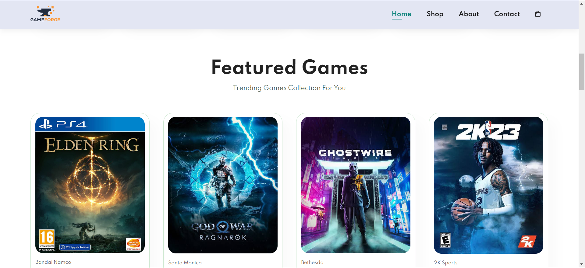

# 🎮 GameForge - E-Commerce Platform for Video Games  

GameForge is a modern e-commerce website designed for gamers to buy and sell video games effortlessly. With a sleek user interface, seamless shopping experience, and optimized navigation, GameForge aims to bring the best gaming deals to enthusiasts worldwide.  

---

## 🚀 Features  

✅ **Modern UI** – A sleek and responsive design for a seamless user experience.  
✅ **Game Listings** – Browse and explore a wide range of video games.  
✅ **Shopping Cart** – Easily add and manage game purchases.  
✅ **Secure Checkout** – Safe and reliable payment integration.    
✅ **Responsive Design** – Fully optimized for mobile, tablet, and desktop users.  

---

## 📸 Screenshots  

---

## 🛠️ Technologies Used  

- **Frontend:** HTML, CSS, JavaScript  
- **Backend:**   
- **Database:**   
- **Frameworks/Libraries:**  

---

## 🔧 Installation & Setup  

To run this project locally, follow these steps:  

1. Clone the repository:  

   git clone https://github.com/AbdulQader856/GameForge-ecommerce-website.git

2. Navigate to the project folder:

    cd GameForge

3. Open Index.html in a browser to view the website.

## 🤝 Contribution

Contributions are welcome! Feel free to submit an issue or a pull request to improve the project.